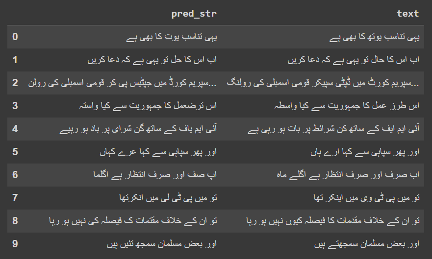

  

# Urdu Speech to Text
A Python Notebook showcasing how to transfer learn the Wav2Vec2 speech model on the Urdu language and how to use the trained model to convert Urdu audio into text. The dataset used in this Notebook is the Mozilla Commonvoice Urdu Dataset v12.0. This Notebook was ran on the free version of Google Colab.

  

